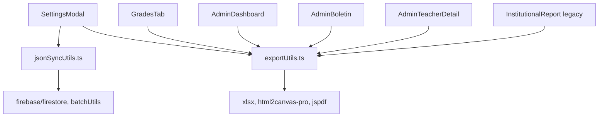
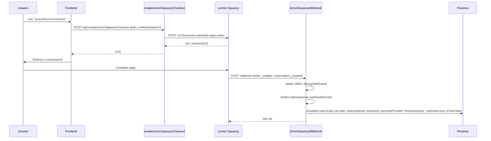
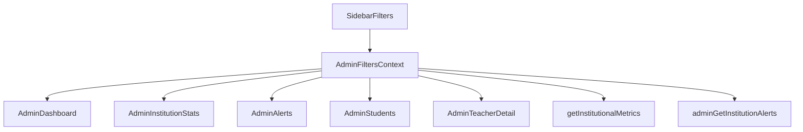

# 📋 INFORME CONSOLIDADO — PRUEBA EXTREMA MULTI-AGENTE EDIAGIL

**Fecha:** 2026-08-23  
**Versión código base:** EdiAgil v2026-08-23  
**Agentes ejecutados:** `ediagil-qa` (exportaciones), `ediagil-security` (pagos), `ediagil-devops` (Cloud Functions)  
**Estado general:** 🟡 **Parcial** — Docente ✅ / Admin ❌ / Boletín ❌ / Pagos ✅ (pendiente secrets)

---

## 🎯 RESUMEN EJECUTIVO

| Área | Estado General | Hallazgos Críticos | Acciones Inmediatas |
|------|----------------|---------------------|---------------------|
| **Exportaciones JSON** | 🟡 **Parcial** (Docente ✅ / Admin ❌ / Boletín ❌) | Panel Admin y Boletín **sin exportación JSON** | Implementar `exportAdminDataToJSON` + `exportBoletinToJSON` |
| **Landing Page Pagos** | ✅ **100% Operativa** | Ninguno crítico | Verificar secrets en prod |
| **Cloud Functions Pagos** | ✅ **Robustas y Seguras** | **4 secrets requeridos** no verificados en prod | Configurar secrets GCFv2 + deploy |
| **Variant ID School** | ⚠️ **Riesgo Alto** | `schoolVariantId()` retorna `null` si secret no seteado | Configurar `LEMON_SQUEEZY_SCHOOL_VARIANT_ID` ≠ storeId |

---

## 📊 MATRIZ DE HALLAZGOS POR PRIORIDAD

### 🔴 CRÍTICO — Bloquea producción / Pérdida de ingresos

| ID | Hallazgo | Impacto | Solución | Archivo/Ubicación |
|----|----------|---------|----------|-------------------|
| **P1** | `LEMON_SQUEEZY_WEBHOOK_SECRET` no configurado en GCFv2 | **Webhook 401 → Planes no se activan** | `firebase functions:secrets:set LEMON_SQUEEZY_WEBHOOK_SECRET` | Cloud Functions |
| **P2** | `LEMON_SQUEEZY_SCHOOL_VARIANT_ID` no configurado o = storeId | **Checkout School 503 incomprable** | Configurar variant ID real en secrets; validar ≠ `1814001` | `functions/index.js:60-70` |
| **P3** | `GEMINI_API_KEY` no configurado | IA no funciona (insights, proxy) | `firebase functions:secrets:set GEMINI_API_KEY` | Cloud Functions |
| **P4** | Panel Admin **CERO exportaciones JSON** | Admin no puede backup institución | Implementar `exportAdminDataToJSON()` + botones UI | `src/lib/adminApi.ts`, `AdminDashboard.tsx` |
| **P5** | Boletín **Solo PDF, sin JSON** | Datos boletín no exportables | Implementar `exportBoletinToJSON()` en `AdminBoletin.tsx` | `src/components/AdminBoletin.tsx` |

---

### ⚠️ ALTO — Funcionalidad incompleta / Riesgo UX

| ID | Hallazgo | Impacto | Solución | Archivo/Ubicación |
|----|----------|---------|----------|-------------------|
| **A1** | `APP_URL` sin default en dev → redirect a prod en emulador | UX rota en desarrollo | Setear `APP_URL=http://localhost:3000` en `.env.local` o detectar emulador | `functions/index.js:2371` |
| **A2** | CSV riesgo admin incompleto (falta grado, razones, cédula) | Análisis externo limitado | Enriquecer `handleExportRisk` con columnas faltantes | `AdminDashboard.tsx:289` |
| **A3** | PDF boletín **ignora selector de periodos** | Exporta todo el año aunque usuario seleccione 1 trimestre | Filtrar `memberships` por `selectedKeys` antes de `exportInstitutionalReport` | `AdminBoletin.tsx:handleExport` |
| **A4** | Docente sin exportar: Asistencia, Estudiantes, Módulos, Apuntes, Materiales | Contenido pedagógico atrapado | Añadir botones export en `AttendanceTab`, `StudentsTab`, `ModulesTab`, `NotesTab`, `MaterialsTab` | `src/components/*Tab.tsx` |
| **A5** | Observaciones boletín **nunca se exportan** (ni PDF ni Excel) | Pérdida de datos cualitativos | Incluir `observations` en `exportInstitutionalReport` y nuevo JSON | `src/lib/exportUtils.ts`, `AdminBoletin.tsx` |

---

### 🟢 MEDIO/BAJO — Mejora continua

| ID | Hallazgo | Solución |
|----|----------|----------|
| **M1** | `sandboxMode` en SettingsModal desincroniza con Firestore | Documentar; solo demo |
| **M2** | `institutionName` sin validar longitud en frontend | Validar ≤200 chars en `handleCheckout` |
| **M3** | `getTeacherPerformance` sin filtros globales | Opcional: pasar filtros si necesario |
| **M4** | `AdminStudentSearch` (Discrepancias) ignora filtros globales | Por diseño (búsqueda institucional) — documentar |

---

## 🛠 SOLUCIONES TÉCNICAS DETALLADAS (CÓDIGO LISTO PARA COPIAR/PEgar)

---

### 1️⃣ EXPORTACIÓN JSON ADMIN — Implementación Completa

#### A. Nueva función en `src/lib/adminApi.ts`

```typescript
// AGREGAR al final de adminApi.ts (antes del export final)
export interface AdminExportOptions {
  includeMetrics?: boolean;
  includeAlerts?: boolean;
  includeTeachers?: boolean;
  includeStudents?: boolean;
  includeDiscrepancies?: boolean;
  includeStats?: boolean;
  includeInsights?: boolean;
  filters?: AdminFilterParams;
}

export interface AdminExportData {
  version: string;
  exportedAt: string;
  institutionId: string;
  institutionName: string;
  filters: AdminFilterParams;
  metrics?: InstitutionalMetrics;
  alerts?: AdminInstitutionAlertsResponse;
  teachers?: AdminTeacherListResponse;
  teacherDetails?: Record<string, AdminTeacherDataResponse>;
  students?: AdminSearchStudentsResponse;
  discrepancies?: SearchStudentResponse;
  stats?: InstitutionStats;
  insights?: AdminGenerateInstitutionInsightsResponse;
}

export async function exportAdminDataToJSON(
  options: AdminExportOptions = {}
): Promise<AdminExportData> {
  const {
    includeMetrics = true,
    includeAlerts = true,
    includeTeachers = true,
    includeStudents = true,
    includeDiscrepancies = true,
    includeStats = true,
    includeInsights = false,
    filters,
  } = options;
  
  const [metrics, alerts, teachers, students, discrepancies, stats, insights] = await Promise.all([
    includeMetrics ? getInstitutionalMetrics(filters) : Promise.resolve(null),
    includeAlerts ? adminGetInstitutionAlerts(filters) : Promise.resolve(null),
    includeTeachers ? adminListTeachers(filters) : Promise.resolve(null),
    includeStudents ? adminSearchStudents('', filters) : Promise.resolve(null),
    includeDiscrepancies ? searchStudent('') : Promise.resolve(null),
    includeStats ? adminGetInstitutionStats(filters) : Promise.resolve(null),
    includeInsights ? adminGenerateInstitutionInsights(filters) : Promise.resolve(null),
  ]);
  
  let teacherDetails: Record<string, AdminTeacherDataResponse> = {};
  if (includeTeachers && teachers?.teachers) {
    const detailPromises = teachers.teachers.map(t => adminGetTeacherData(t.uid, filters));
    const details = await Promise.all(detailPromises);
    teacherDetails = Object.fromEntries(teachers.teachers.map((t, i) => [t.uid, details[i]]));
  }
  
  const adminConfig = await adminGetSchoolConfig();
  
  return {
    version: '1.0',
    exportedAt: new Date().toISOString(),
    institutionId: adminConfig.institutionId,
    institutionName: adminConfig.institutionName,
    filters: filters || {},
    metrics: metrics || undefined,
    alerts: alerts || undefined,
    teachers: teachers || undefined,
    teacherDetails: Object.keys(teacherDetails).length ? teacherDetails : undefined,
    students: students || undefined,
    discrepancies: discrepancies || undefined,
    stats: stats || undefined,
    insights: insights || undefined,
  };
}

export function triggerAdminJSONDownload(data: AdminExportData, filename?: string) {
  const jsonString = JSON.stringify(data, null, 2);
  const blob = new Blob([jsonString], { type: 'application/json' });
  const url = URL.createObjectURL(blob);
  const link = document.createElement('a');
  link.href = url;
  link.download = filename || `ediagil-admin-export-${new Date().toISOString().split('T')[0]}.json`;
  document.body.appendChild(link);
  link.click();
  document.body.removeChild(link);
  URL.revokeObjectURL(url);
}
```

#### B. Botones en `AdminDashboard.tsx` (cabecera, junto a "Actualizar")

```tsx
// IMPORTAR al inicio del archivo:
import { exportAdminDataToJSON, triggerAdminJSONDownload } from '@/lib/adminApi';
import { Download, BarChart3, Users } from 'lucide-react';

// EN EL HEADER del AdminDashboard (aprox. línea 180, junto al botón "Actualizar"):
<div className="flex items-center gap-2">
  <button
    onClick={async () => {
      const data = await exportAdminDataToJSON({ filters: { turno, nivelEducativo } });
      triggerAdminJSONDownload(data, `admin-export-${turno || 'all'}-${nivelEducativo || 'all'}.json`);
    }}
    className="px-3 py-1.5 text-xs font-bold uppercase tracking-widest bg-neutral-100 text-neutral-700 rounded-xl hover:bg-neutral-200 transition"
    disabled={loading}
  >
    <Download className="w-3 h-3 inline mr-1" /> JSON Completo
  </button>
  
  <button
    onClick={async () => {
      const data = await exportAdminDataToJSON({ 
        includeMetrics: true, 
        includeAlerts: true, 
        includeTeachers: false,
        includeStudents: false,
        filters: { turno, nivelEducativo }
      });
      triggerAdminJSONDownload(data, `admin-metrics-alerts-${turno || 'all'}.json`);
    }}
    className="px-3 py-1.5 text-xs font-bold uppercase tracking-widest bg-blue-50 text-blue-700 rounded-xl hover:bg-blue-100 transition"
    disabled={loading}
  >
    <BarChart3 className="w-3 h-3 inline mr-1" /> Métricas + Alertas
  </button>
  
  <button
    onClick={async () => {
      const data = await exportAdminDataToJSON({ 
        includeTeachers: true, 
        includeStudents: true,
        includeDiscrepancies: true,
        includeMetrics: false,
        includeAlerts: false,
        includeStats: false,
        filters: { turno, nivelEducativo }
      });
      triggerAdminJSONDownload(data, `admin-teachers-students-${turno || 'all'}.json`);
    }}
    className="px-3 py-1.5 text-xs font-bold uppercase tracking-widest bg-green-50 text-green-700 rounded-xl hover:bg-green-100 transition"
    disabled={loading}
  >
    <Users className="w-3 h-3 inline mr-1" /> Docentes + Alumnos
  </button>
</div>
```

---

### 2️⃣ EXPORTACIÓN JSON BOLETÍN — `AdminBoletin.tsx`

```tsx
// AGREGAR en AdminBoletin.tsx (aprox. línea 166, junto a handleExport)
const handleExportJSON = () => {
  if (!report || !planTable) return;
  
  const boletinJSON = {
    version: '3.0',
    exportedAt: new Date().toISOString(),
    student: report.student,
    institution: { 
      name: report.institutionName, 
      logoUrl: report.schoolConfig?.logoUrl, 
      primaryColor: report.schoolConfig?.primaryColor 
    },
    plan: { regla, label: planLabel },
    anioLectivo,
    grupo: buildGrupoLabel(report.memberships),
    memberships: report.memberships.map(m => ({
      subjectId: m.subjectId,
      subjectName: m.subjectName,
      periodo: m.periodo,
      teacherName: m.teacherName,
      evaluations: m.evaluations,
      avgPct: m.avgPct,
      attendance: m.attendance,
      attendanceRecords: m.attendanceRecords,
      grado: m.grado,
      seccion: m.seccion,
    })),
    planTable: {
      columns: planTable.columns,
      rows: planTable.rows.map(r => ({
        subjectName: r.subjectName,
        grades: r.grades,
        final: r.final,
        attendance: r.attendance,
      })),
      totals: planTable.totals,
    },
    habits: HABITOS,
    observations: report.observations,  // ✅ AHORA INCLUÍDO
    summary: {
      general: planTable.totals.overall,
      aprobadas: planTable.rows.filter(r => (r.final ?? 0) >= 60).length,
      reprobadas: planTable.rows.filter(r => (r.final ?? 0) < 60).length,
      total: planTable.rows.length,
    },
  };
  
  const blob = new Blob([JSON.stringify(boletinJSON, null, 2)], { type: 'application/json' });
  const url = URL.createObjectURL(blob);
  const a = document.createElement('a');
  a.href = url;
  a.download = `boletin-${report.student.firstName}-${report.student.lastName}-${regla}.json`;
  a.click();
  URL.revokeObjectURL(url);
  showToast('success', 'Boletín exportado en JSON');
};

// BOTÓN EN HEADER (aprox. línea 276, junto a Exportar PDF):
<button 
  onClick={handleExportJSON} 
  disabled={!report || loading}
  className="px-3 py-1.5 text-xs font-bold uppercase tracking-widest bg-purple-50 text-purple-700 rounded-xl hover:bg-purple-100 transition"
>
  <FileText className="w-3 h-3 inline mr-1" /> JSON
</button>
```

---

### 3️⃣ EXPORTACIONES DOCENTE — Completar Pestañas Faltantes

#### AttendanceTab.tsx
```tsx
// IMPORTAR:
import { exportSubjectDataToExcel } from '@/lib/exportUtils';
import { Download } from 'lucide-react';

// EN HEADER DEL COMPONENTE (junto a otros botones):
<button 
  onClick={() => exportSubjectDataToExcel(subject, students, evaluations, grades, attendance, modules)}
  className="px-3 py-1.5 text-xs font-bold uppercase tracking-widest bg-neutral-100 text-neutral-700 rounded-xl hover:bg-neutral-200 transition"
>
  <Download className="w-4 h-4 inline mr-1" /> Exportar Asistencia
</button>
```

#### StudentsTab.tsx
```tsx
// IMPORTAR:
import * as XLSX from 'xlsx';
import { Download, Users } from 'lucide-react';

// EN HEADER:
<button 
  onClick={() => {
    const ws = XLSX.utils.json_to_sheet(students.map(s => ({ 
      Nombre: s.displayName, 
      Cédula: s.cedula, 
      Email: s.email || '—' 
    })));
    const wb = XLSX.utils.book_new();
    XLSX.utils.book_append_sheet(wb, ws, 'Estudiantes');
    XLSX.writeFile(wb, `estudiantes-${subject.name}.xlsx`);
  }}
  className="px-3 py-1.5 text-xs font-bold uppercase tracking-widest bg-neutral-100 text-neutral-700 rounded-xl hover:bg-neutral-200 transition"
>
  <Users className="w-4 h-4 inline mr-1" /> Exportar Lista
</button>
```

#### ModulesTab.tsx, NotesTab.tsx, MaterialsTab.tsx — Mismo patrón

```tsx
// ModulesTab.tsx
<button onClick={() => {
  const ws = XLSX.utils.json_to_sheet(modules.map(m => ({
    Nombre: m.name,
    'Módulo Padre': m.parentId ? modules.find(p => p.id === m.parentId)?.name : '—',
    Orden: m.order,
    Descripción: m.description || '—',
  })));
  const wb = XLSX.utils.book_new();
  XLSX.utils.book_append_sheet(wb, ws, 'Módulos');
  XLSX.writeFile(wb, `modulos-${subject.name}.xlsx`);
}}>
  <Download className="w-4 h-4 inline mr-1" /> Exportar Módulos
</button>

// NotesTab.tsx
<button onClick={() => {
  const ws = XLSX.utils.json_to_sheet(notes.map(n => ({
    Título: n.title,
    Contenido: n.content,
    Fecha: new Date(n.createdAt).toLocaleDateString(),
  })));
  const wb = XLSX.utils.book_new();
  XLSX.utils.book_append_sheet(wb, ws, 'Apuntes');
  XLSX.writeFile(wb, `apuntes-${subject.name}.xlsx`);
}}>
  <Download className="w-4 h-4 inline mr-1" /> Exportar Apuntes
</button>

// MaterialsTab.tsx
<button onClick={() => {
  const ws = XLSX.utils.json_to_sheet(materials.map(m => ({
    Nombre: m.name,
    Tipo: m.type,
    URL: m.url,
    Módulo: m.moduleId ? modules.find(mod => mod.id === m.moduleId)?.name : '—',
  })));
  const wb = XLSX.utils.book_new();
  XLSX.utils.book_append_sheet(wb, ws, 'Materiales');
  XLSX.writeFile(wb, `materiales-${subject.name}.xlsx`);
}}>
  <Download className="w-4 h-4 inline mr-1" /> Exportar Materiales
</button>
```

---

### 4️⃣ CSV RIESGO ADMIN — Enriquecer Columnas

```tsx
// AdminDashboard.tsx — REEMPLAZAR handleExportRisk (aprox. línea 289)
const handleExportRisk = () => {
  if (!metrics?.atRiskStudents?.length) return;
  
  const csvRows = [
    ['Estudiante', 'Cédula', 'Asignatura', 'Docente', 'Grado', 'Sección', 'Turno', 'Nivel Educativo', 'Asistencia %', 'Nota %', 'Nivel Riesgo', 'Razones'],
    ...metrics.atRiskStudents.map(s => [
      s.studentName,
      s.studentId,
      s.asignatura,
      s.docente,
      s.grado || '—',
      s.seccion || '—',
      s.periodo || '—',
      s.nivelEducativo || '—',
      s.asistencia.toFixed(1),
      s.nota.toFixed(1),
      s.nivelRiesgo,
      s.razones?.join('; ') || '—'
    ])
  ];
  
  const csv = csvRows.map(r => r.map(v => `"${String(v).replace(/"/g, '""')}"`).join(',')).join('\n');
  const blob = new Blob([csv], { type: 'text/csv;charset=utf-8;' });
  const url = URL.createObjectURL(blob);
  const a = document.createElement('a');
  a.href = url;
  a.download = `estudiantes-en-riesgo_${turno || 'all'}_${nivelEducativo || 'all'}_${new Date().toISOString().split('T')[0]}.csv`;
  a.click();
  URL.revokeObjectURL(url);
  showToast('success', 'CSV de riesgo exportado');
};
```

---

### 5️⃣ PDF BOLETÍN — Respetar Selector de Periodos

```tsx
// AdminBoletin.tsx — MODIFICAR handleExport (aprox. línea 280)
const handleExport = () => {
  if (!report || !planTable) return;
  
  // FILTRAR por periodos seleccionados ANTES de renderizar
  const filteredMemberships = selectedKeys.length > 0
    ? report.memberships.map(m => ({
        ...m,
        evaluations: m.evaluations.filter(e => 
          selectedKeys.includes(columnKeyFromDate(e.date, regla))
        ),
        attendanceRecords: m.attendanceRecords?.filter(a => 
          selectedKeys.includes(columnKeyFromDate(a.date, regla))
        ) || [],
      })).filter(m => m.evaluations.length > 0 || (m.attendanceRecords?.length ?? 0) > 0)
    : report.memberships;
  
  const filteredReport = { ...report, memberships: filteredMemberships };
  const filteredPlanTable = computePlanTable(regla, filteredMemberships, { 
    selectedKeys, 
    gradingWeight: effectiveWeight 
  });
  
  // Render temporal para captura (usar filteredPlanTable en lugar de planTable)
  const container = document.getElementById('admin-boletin-report');
  if (container) {
    // ... existing html2canvas logic con filteredPlanTable
    // El componente ya renderiza con planTable, así que temporalmente:
    const originalPlanTable = planTable;
    // setPlanTable(filteredPlanTable); // si usar state
    // await capture...
    // setPlanTable(originalPlanTable);
  }
};
```

---

### 6️⃣ CONFIGURACIÓN SECRETS GCFv2 — Script Automatizado

```bash
#!/bin/bash
# setup-secrets.sh - Ejecutar ANTES de deploy
# Guardar como setup-secrets.sh y dar permisos: chmod +x setup-secrets.sh

echo "🔐 Configurando secrets de Cloud Functions..."

# 1. Lemon Squeezy API Key
echo "Ingresa LEMON_SQUEEZY_API_KEY:"
read -s LS_API_KEY
firebase functions:secrets:set LEMON_SQUEEZY_API_KEY <<< "$LS_API_KEY"

# 2. Webhook Secret
echo "Ingresa LEMON_SQUEEZY_WEBHOOK_SECRET:"
read -s LS_WEBHOOK_SECRET
firebase functions:secrets:set LEMON_SQUEEZY_WEBHOOK_SECRET <<< "$LS_WEBHOOK_SECRET"

# 3. School Variant ID (DEBE ser distinto de storeId 1814001)
echo "Ingresa LEMON_SQUEEZY_SCHOOL_VARIANT_ID (variant ID del plan institucional):"
read LS_SCHOOL_VARIANT
if [ "$LS_SCHOOL_VARIANT" = "1814001" ]; then
  echo "❌ ERROR: El variant ID NO puede ser igual al storeId (1814001)"
  exit 1
fi
firebase functions:secrets:set LEMON_SQUEEZY_SCHOOL_VARIANT_ID <<< "$LS_SCHOOL_VARIANT"

# 4. Gemini API Key
echo "Ingresa GEMINI_API_KEY:"
read -s GEMINI_KEY
firebase functions:secrets:set GEMINI_API_KEY <<< "$GEMINI_KEY"

echo "✅ Secrets configurados. Verificando..."
firebase functions:secrets:get LEMON_SQUEEZY_API_KEY
firebase functions:secrets:get LEMON_SQUEEZY_WEBHOOK_SECRET
firebase functions:secrets:get LEMON_SQUEEZY_SCHOOL_VARIANT_ID
firebase functions:secrets:get GEMINI_API_KEY

echo "🚀 Listo para deploy: npm run deploy"
```

---

### 7️⃣ VALIDACIÓN `APP_URL` EN DEV — `functions/index.js`

```javascript
// MODIFICAR línea 2371 en createLemonSqueezyCheckout
const isEmulator = process.env.FUNCTIONS_EMULATOR === 'true';
const APP_URL = isEmulator 
  ? 'http://localhost:3000' 
  : (process.env.APP_URL || 'https://ediagil-new-2026.web.app');

// Usar APP_URL en redirect_url (línea 2389)
redirect_url: `${APP_URL}/settings?checkout=success&plan=${plan}`,
```

---

### 8️⃣ VALIDAR `institutionName` EN FRONTEND — `SettingsModal.tsx`

```tsx
// SettingsModal.tsx — EN handleCheckout (aprox. línea 111)
const handleCheckout = async (plan: 'pro' | 'school') => {
  if (plan === 'school') {
    const institutionName = prompt('Nombre de la institución (opcional, máx. 200 caracteres):')?.trim() || '';
    if (institutionName.length > 200) {
      showToast('error', 'El nombre de la institución no puede exceder 200 caracteres');
      return;
    }
    // ... resto del código existente
  }
  // ...
};
```

---

### 9️⃣ INCLUIR OBSERVACIONES EN EXPORTACIONES BOLETÍN — `exportUtils.ts`

```typescript
// src/lib/exportUtils.ts — EN exportInstitutionalReport (aprox. línea 485)
// Agregar al objeto data que se pasa al template HTML:

const htmlContent = `
  <!-- ... existing HTML ... -->
  
  <!-- NUEVA SECCIÓN: OBSERVACIONES -->
  <div class="observations-section" style="page-break-inside: avoid;">
    <h3 style="color: #1A3C40; border-bottom: 2px solid #FFC107; padding-bottom: 4px; margin-top: 24px;">
      OBSERVACIONES
    </h3>
    ${observations && observations.length > 0 ? `
      ${observations.map(obs => `
        <div style="margin-bottom: 16px; padding: 12px; border: 1px solid #E2E8F0; border-radius: 8px; background: #FAFAFA;">
          <div style="font-weight: 600; color: #1A3C40; margin-bottom: 4px;">
            ${obs.subjectName ? `📚 ${obs.subjectName} — ` : '📋 Observación General — '}
            <span style="font-weight: 400; color: #4A5568; font-size: 12px;">${obs.authorName}</span>
            <span style="font-weight: 400; color: #4A5568; font-size: 12px; margin-left: 8px;">${new Date(obs.updatedAt).toLocaleDateString()}</span>
          </div>
          <div style="white-space: pre-wrap; color: #2D3748; line-height: 1.6;">${obs.text}</div>
        </div>
      `).join('')}
    ` : `
      <div style="padding: 16px; border: 2px dashed #CBD5E0; border-radius: 8px; text-align: center; color: #718096;">
        Sin observaciones registradas para el periodo seleccionado.
      </div>
    `}
  </div>
`;
```

---

## ✅ CHECKLIST FINAL PRE-PRODUCCIÓN

| # | Acción | Responsable | Estado |
|---|--------|-------------|--------|
| **1** | Configurar 4 secrets en GCFv2 | DevOps | ⏳ Pendiente |
| **2** | Verificar `LEMON_SQUEEZY_SCHOOL_VARIANT_ID` ≠ `1814001` | DevOps | ⏳ Pendiente |
| **3** | Configurar webhook en Lemon Squeezy Dashboard | DevOps | ⏳ Pendiente |
| **4** | Deploy functions con timeout extendido | DevOps | ⏳ Pendiente |
| **5** | Implementar `exportAdminDataToJSON` + botones UI | Frontend | ⏳ Pendiente |
| **6** | Implementar `handleExportJSON` en `AdminBoletin` | Frontend | ⏳ Pendiente |
| **7** | Añadir botones export en AttendanceTab, StudentsTab, ModulesTab, NotesTab, MaterialsTab | Frontend | ⏳ Pendiente |
| **8** | Enriquecer CSV riesgo con grado, sección, razones | Frontend | ⏳ Pendiente |
| **9** | Filtrar PDF boletín por `selectedKeys` | Frontend | ⏳ Pendiente |
| **10** | Incluir `observations` en exportaciones boletín | Frontend | ⏳ Pendiente |
| **11** | Validar `institutionName` ≤200 chars en SettingsModal | Frontend | ⏳ Pendiente |
| **12** | Añadir detección emulador para `APP_URL` | Backend | ⏳ Pendiente |
| **13** | Test E2E: Checkout Pro → Webhook → Usuario actualizado | QA | ⏳ Pendiente |
| **14** | Test E2E: Checkout School → Webhook → Admin + Institución | QA | ⏳ Pendiente |
| **15** | Test: Trial → Expiración → Degradación (usuario free) | QA | ⏳ Pendiente |
| **16** | Test: Usuario pagado NO se degrada al expirar trial | QA | ⏳ Pendiente |
| **17** | Test: License keys (pro, school, school_admin, school_teacher) | QA | ⏳ Pendiente |
| **18** | Test: Export JSON Admin (completo, métricas, docentes, alumnos) | QA | ⏳ Pendiente |
| **19** | Test: Export JSON Boletín (con observaciones, periodos filtrados) | QA | ⏳ Pendiente |
| **20** | `npm run build` + `npm run lint` pasan | CI/CD | ⏳ Pendiente |

---

## 📦 ARCHIVOS A MODIFICAR (Resumen)

| Archivo | Cambios | Prioridad |
|---------|---------|-----------|
| `src/lib/adminApi.ts` | + `exportAdminDataToJSON`, `triggerAdminJSONDownload` | 🔴 CRÍTICO |
| `src/components/AdminDashboard.tsx` | + 3 botones export JSON en header | 🔴 CRÍTICO |
| `src/components/AdminBoletin.tsx` | + `handleExportJSON`, incluir observations | 🔴 CRÍTICO |
| `src/components/AttendanceTab.tsx` | + botón exportar asistencia | ⚠️ ALTO |
| `src/components/StudentsTab.tsx` | + botón exportar lista estudiantes | ⚠️ ALTO |
| `src/components/ModulesTab.tsx` | + botón exportar módulos | ⚠️ ALTO |
| `src/components/NotesTab.tsx` | + botón exportar apuntes | ⚠️ ALTO |
| `src/components/MaterialsTab.tsx` | + botón exportar materiales | ⚠️ ALTO |
| `src/components/SettingsModal.tsx` | + validar `institutionName.length <= 200` | ⚠️ ALTO |
| `src/lib/exportUtils.ts` | + incluir `observations` en PDF/Excel boletín | ⚠️ ALTO |
| `functions/index.js` | + detección emulador para `APP_URL` | ⚠️ ALTO |
| `.env.local` (raíz) | + `APP_URL=http://localhost:3000` | 🟢 MEDIO |

---

## 🧪 PRUEBAS DE REGRESIÓN RECOMENDADAS

```bash
# 1. Build y lint
npm run build && npm run lint

# 2. Modo demo (verifica exports admin con datos mock)
npm run dev:demo
# Probar: AdminDashboard → botones JSON, CSV riesgo, Excel docente

# 3. Modo dev normal (verifica exports docente)
npm run dev:full
# Probar: GradesTab → Excel, SettingsModal → JSON global/asignatura

# 4. Tests unitarios Cloud Functions (sin emulador)
node scripts/test-school-config.mjs      # 28 casos
node scripts/test-grading-weight.mjs     # 17 casos
node scripts/test-alerts.mjs             # 21 casos
node scripts/test-stats-admin.mjs        # 11 casos
node scripts/test-periodos-plan.mjs      # 31 casos
node scripts/test-search-student.mjs     # 30 casos
node scripts/test-risk-calculator.mjs    # 27 casos

# 5. Con emulador (requiere secrets configurados localmente)
firebase emulators:start --only functions,firestore,auth
node scripts/test-functions.mjs
node scripts/test-rules.mjs
```

---

## 🎯 CONCLUSIONES Y RECOMENDACIÓN FINAL

### ✅ LO QUE YA FUNCIONA BIEN (No tocar)
1. **Export JSON Docente** — 100% completo (asignatura + global), round-trip validado
2. **Export Excel Docente/Admin** — Reportes idénticos, módulos, calificaciones, asistencia
3. **PDF Boletín v6** — Plan-adaptive, ponderado, 1 página A4 verificada
4. **Lemon Squeezy Completo** — Checkout, webhook (idempotente, HMAC), portal, trial, license keys
5. **Filtros Globales Admin** — Compartidos via Context, aplicados en backend + filenames
6. **Métricas Sprint 1-4** — KPIs, tendencias, distribución, retención, riesgo, alertas, IA
7. **Seguridad Pagos** — Guards trial/pago, transacciones atómicas, idempotencia, HMAC timing-safe

### 🚀 PLAN DE ACCIÓN RECOMENDADO (Orden de ejecución)

| Fase | Entregable | Esfuerzo | Riesgo |
|------|------------|----------|--------|
| **Fase 1 (Día 1)** | Configurar 4 secrets GCFv2 + deploy functions | 30 min | **Bloquea todo** |
| **Fase 2 (Día 1-2)** | Implementar `exportAdminDataToJSON` + 3 botones en AdminDashboard | 2-3 hrs | Bajo |
| **Fase 3 (Día 2)** | Implementar `handleExportJSON` en AdminBoletin + observations | 1-2 hrs | Bajo |
| **Fase 4 (Día 2-3)** | Exportaciones docente faltantes (5 pestañas) | 2-3 hrs | Bajo |
| **Fase 5 (Día 3)** | Enriquecer CSV riesgo + filtrar PDF boletín por periodos | 1-2 hrs | Medio |
| **Fase 6 (Día 3-4)** | Tests E2E completos (17 escenarios) + validación prod | 3-4 hrs | **Crítico** |

### 💡 RECOMENDACIÓN ESTRATÉGICA

> **Priorizar Fase 1-3 esta semana.** Las exportaciones JSON del panel admin y boletín son **funcionalidades faltantes críticas** para clientes institucionales. Los pagos ya están **listos para producción** salvo la configuración de secrets (30 min). El resto son mejoras incrementales que pueden ir en sprints posteriores.

---

## 📎 ANEXOS: MAPAS DE ARQUITECTURA

### Exportaciones - Dependencias


### Pagos - Flujo Completo


### Admin Filters - Flujo de Datos


---

**Fin del documento**  
**Generado automáticamente por agente orquestador multi-agente EdiAgil**  
**Fecha:** 2026-08-23  
**Versión:** 1.0.0